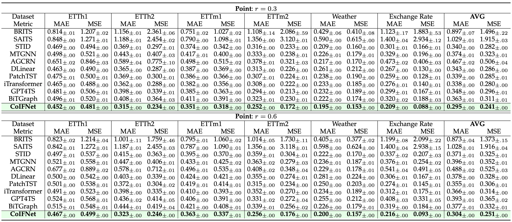
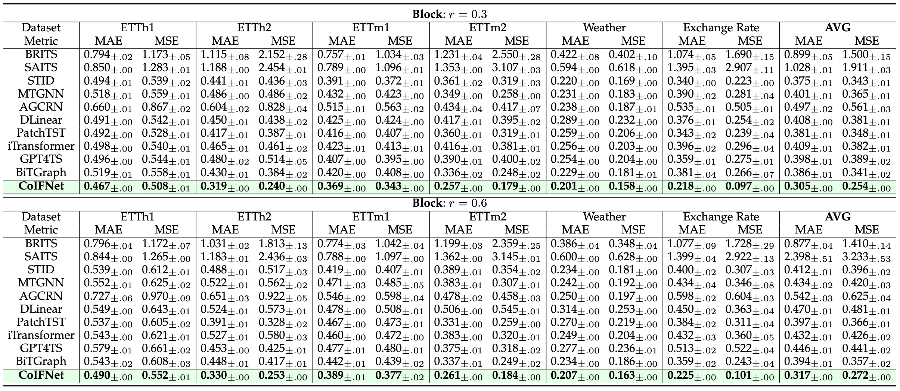

# CoIFNet: Collaborative Imputation and Forecasting Network

[](https://opensource.org/licenses/MIT)

Official implementation of the paper **CoIFNet: A Unified Framework for Multivariate Time Series Forecasting with Missing Values**. CoIFNet is a unified deep learning framework designed to time series forecasting with missing values.

*(**Note**: We are actively improving this work. If you have any questions or find any bugs, please feel free to create an issue in this repo.)*

- **News(2025, 06)**:  Initial code release for CoIFNet.

---

## Highlights

> **Abstract:** Multivariate time series forecasting (MTSF) is a critical task with broad applications in domains such as meteorology, transportation, and economics. Nevertheless, pervasive missing values caused by sensor failures or human errors significantly degrade forecasting accuracy. Prior efforts usually employ an impute-then-forecast paradigm, leading to suboptimal predictions due to error accumulation and misaligned objectives between the two stages.To address this challenge, we propose the Collaborative Imputation-Forecasting Network (CoIFNet), a novel framework that unifies imputation and forecasting to achieve robust MTSF in the presence of missing values. Specifically, CoIFNet takes the observed values, mask matrix and timestamp embeddings as input, processing them sequentially through the Cross-Timestep Fusion (CTF) and Cross-Variate Fusion (CVF) modules to capture temporal dependencies that are robust to missing values. We provide theoretical justifications on how our CoIFNet learning objective improves the performance bound of MTSF with missing values. Through extensive experiments on challenging MSTF benchmarks, we demonstrate the effectiveness and computational efficiency of our proposed approach across diverse missing-data scenarios, e.g., CoIFNet outperforms the state-of-the-art method by $\underline{\textbf{24.40}}\%$ ($\underline{\textbf{23.81}}\%$) at a point (block) missing rate of 0.6, while improving memory and time efficiency by  $\underline{\boldsymbol{4.3\times}}$ and $\underline{\boldsymbol{2.1\times}}$, respectively. 

<div align="center">
  
</div>
<p align="center"><i><b>Figure 1:</b> The overall architecture of CoIFNet.</i></p>

---

## Main Contributions

> 1.  We propose CoIFNet, which unifies imputation and forecasting into a single framework to achieve robust MTSF in the presence of missing values.
> 2.  We theoretically demonstrate the superiority of our one-stage CoIFNet framework over traditional two-stage approaches for handling missing values in time series forecasting.
> 3.  Extensive experiments on six challenging real-world datasets demonstrate the effectiveness and computational efficiency of our proposed approach across diverse missing-data scenarios.

---

## Performance Highlights

CoIFNet consistently achieves superior performance across multiple datasets and missing data scenarios.

**Efficient and Effective**
<div align="center">
  
  
</div>
<p align="center"><i><b>Figure 2:</b> Overall performance and efficiency comparison with baseline models.</i></p>


**Forecasting Performance in Point Missing**
<div align="center">
  
</div>
<p align="center"><i><b>Figure 3:</b> Forecasting performance (MSE/MAE) comparison under <b>point-wise missing</b> scenarios.</i></p>

**Forecasting Performance in Point Missing**
<div align="center">
  
</div>
<p align="center"><i><b>Figure 4:</b> Forecasting performance (MSE/MAE) comparison under <b>block-wise missing</b> scenarios.</i></p>


---

## Installation

This codebase has been tested on Ubuntu 22.04 with Python 3.11 and PyTorch 2.1. We recommend using `uv` for fast and reliable dependency management.

```bash
# 1. Clone the repository
git clone https://github.com/KaiTang-eng/CoIFNet.git
cd CoIFNet

# 2. Create a virtual environment (optional but recommended)
uv venv

# 3. Install all dependencies from pyproject.toml
uv sync
```

---

## Data Preparation

1.  Download the required datasets (e.g., ETT, Weather, etc.). A common source is the [Autoformer repository](https://github.com/thuml/Autoformer/tree/main/data).
2.  Place all dataset files (e.g., `ETTh1.csv`) into a single directory.
3.  Update the `data_root` path in the configuration file (`conf/conf.yaml`) to point to your dataset directory.

---

## Training and Evaluation

We use [Hydra](https://hydra.cc/) for configuration management, making it easy to run experiments. All configurations are located in the `conf/` directory.

**Run an Experiment**
This command trains and evaluates CoIFNet on the ETTh1 dataset. By default, it performs 3 runs with different random seeds for stable results.
```bash
# (Optional): Activate the environment if you created one
source .venv/bin/activate 

# Run the experiment
uv run python main.py dataset=etth1 model=CoIFNet
```
All outputs, including logs, model checkpoints, and final results, will be saved to the `outputs/` directory, organized by date and time.

### Experiment Tracking with MLflow (Optional)
The project is integrated with MLflow for advanced experiment tracking.

```bash
# 1. Start the MLflow tracking server
mlflow ui --host 0.0.0.0 --port 5000

# 2. Set the tracking URI as an environment variable
export MLFLOW_TRACKING_URI="http://localhost:5000"

# 3. Run your experiments as usual
uv run python main.py dataset=etth1 model=CoIFNet
```
Your runs will now be logged to the MLflow UI, accessible at `http://localhost:5000`.


---

# Project Structure
<details>
<summary>Click to expand</summary>

```
CoIFNet/
├── conf/                   # Hydra configuration files
│   ├── dataset/            # Dataset-specific configurations
│   ├── model/              # Model-specific configurations
│   └── default.yaml        # Default experimental settings
├── dataset/                # Data loading and preprocessing
│   ├── mask/               # Missing pattern generation
│   └── ...
├── model/                  # Model implementations
├── trainer/                # Training and evaluation logic
├── utils/                  # Helper functions, metrics, and logger
├── assets/                 # Images and assets for the README
├── main_n_run.py           # Main script for running experiments
└── requirements.txt        # Python dependencies
```
</details>

---

# Citation

If you find this work useful for your research, please consider citing our paper:
```bibtex
@article{coifnet2025,
    title={CoIFNet: A Unified Framework for Multivariate Time Series Forecasting with Missing Values},
    author={Tang, Kai and Zhang, Ji* and Meng, Hua and Ma, Minbo and Xiong, Qi and Lv, Fengmao and Xu, Jie and Li, Tianrui},
    year={2025},
}
```

---

# Acknowledgements
Our implementation benefits from several open-source projects. We would like to thank the authors of:
- [Autoformer](https://github.com/thuml/Autoformer) for the datasets and data processing scripts.
- [RevIN](https://github.com/ts-kim/RevIN) for the reversible instance normalization concept.