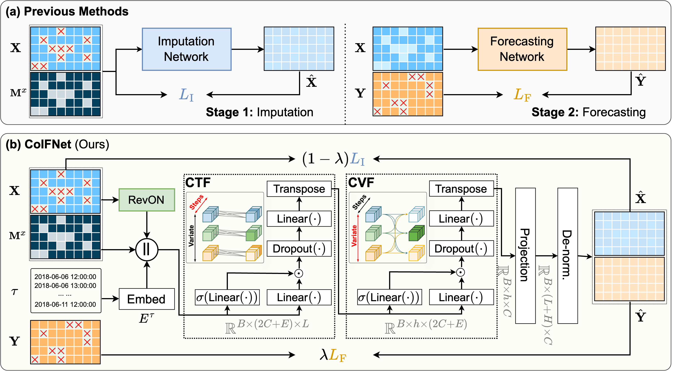
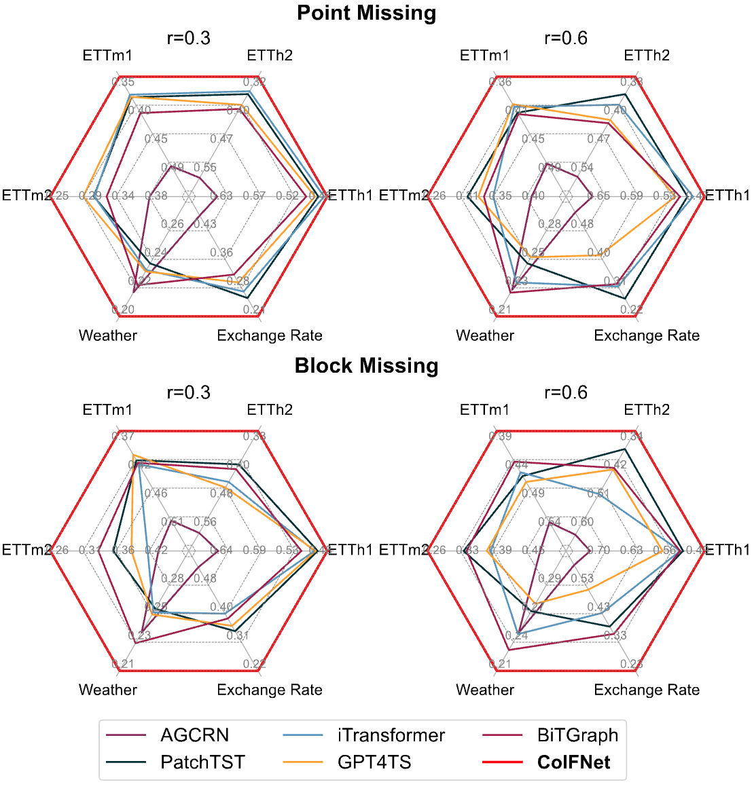
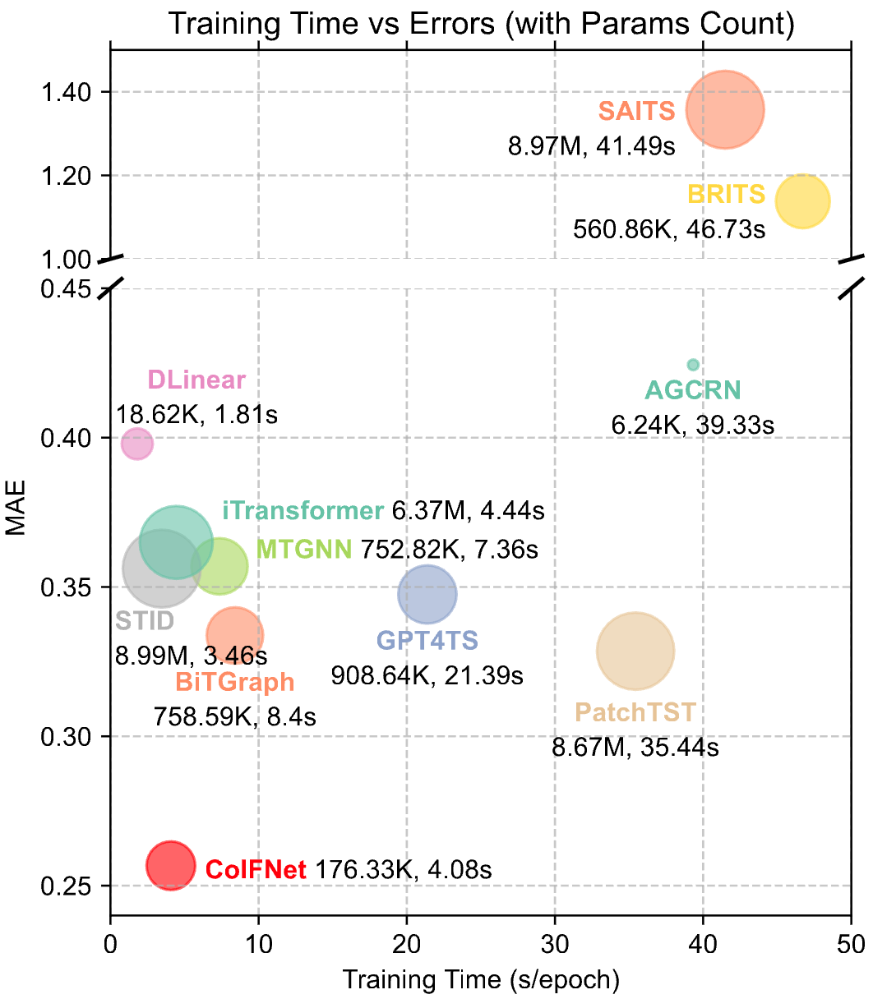
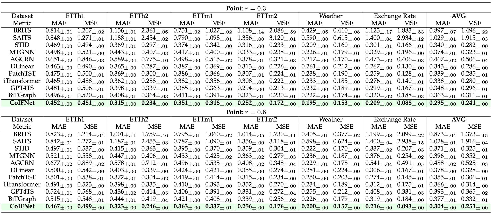
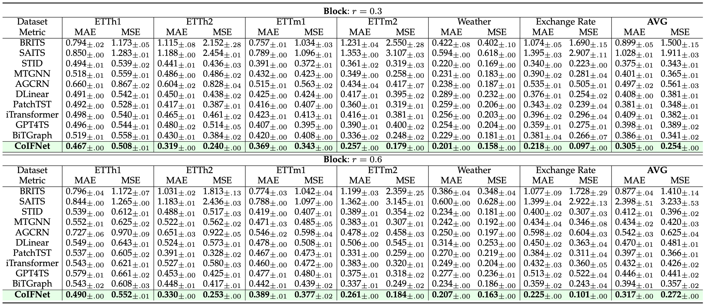

Excellent! This revised version is much stronger and contains all the necessary details. It's very close to a professional, publication-ready README. My optimization will focus on polishing the language, improving clarity, and ensuring the structure is as user-friendly as possible, following the best practices from top-tier repositories.

Here is the optimized version of your README.

### Key Changes:
-   **Professional Phrasing:** Replaced some phrases with more standard academic/open-source terminology (e.g., "Official PyTorch implementation," "State-of-the-Art," "dependency management").
-   **Clarity and Conciseness:** Simplified sentences and made instructions more direct and step-by-step.
-   **Consistency:** Ensured consistency in terminology and formatting (e.g., fixed caption typos, corrected repeated section titles).
-   **Enhanced Instructions:** Made the `Installation` and `Data Preparation` sections more explicit to prevent user confusion.
-   **Added Badges:** Included Python and PyTorch version badges for quick reference, which is standard practice.

---

# CoIFNet: Collaborative Imputation and Forecasting Network

[](https://pytorch.org/)
[](https://www.python.org/downloads/release/python-3110/)
[](https://opensource.org/licenses/MIT)

This is the official PyTorch implementation of the paper: **CoIFNet: A Unified Framework for Multivariate Time Series Forecasting with Missing Values**.

*(**Note**: This project is under active development. If you have any questions or find any bugs, please feel free to open an issue.)*

---

# News
- **(Jun. 2025)** Initial code release for CoIFNet.
- **(TBA)** Paper accepted at [Conference/Journal Name].
- **(TBA)** Paper available on arXiv.

---

# Highlights

> **Abstract:** Multivariate time series forecasting (MTSF) is a critical task with broad applications in domains such as meteorology, transportation, and economics. Nevertheless, pervasive missing values caused by sensor failures or human errors significantly degrade forecasting accuracy. Prior efforts usually employ an impute-then-forecast paradigm, leading to suboptimal predictions due to error accumulation and misaligned objectives between the two stages. To address this challenge, we propose the Collaborative Imputation-Forecasting Network (CoIFNet), a novel framework that unifies imputation and forecasting to achieve robust MTSF in the presence of missing values. Specifically, CoIFNet takes the observed values, mask matrix and timestamp embeddings as input, processing them sequentially through the Cross-Timestep Fusion (CTF) and Cross-Variate Fusion (CVF) modules to capture temporal dependencies that are robust to missing values. We provide theoretical justifications on how our CoIFNet learning objective improves the performance bound of MTSF with missing values. Through extensive experiments on challenging MTSF benchmarks, we demonstrate the effectiveness and computational efficiency of our proposed approach across diverse missing-data scenarios, e.g., CoIFNet outperforms the state-of-the-art method by **24.40%** (**23.81%**) at a point (block) missing rate of 0.6, while improving memory and time efficiency by **4.3x** and **2.1x**, respectively.

<div align="center">
  
</div>
<p align="center"><i><b>Figure 1:</b> The overall architecture of the CoIFNet framework.</i></p>

---

# Main Contributions

1.  **Unified Framework:** We propose CoIFNet, a novel end-to-end framework that unifies imputation and forecasting to achieve robust multivariate time series forecasting in the presence of missing values.
2.  **Theoretical Guarantees:** We theoretically demonstrate the superiority of our one-stage CoIFNet framework over traditional two-stage approaches for handling missing data in time series forecasting.
3.  **State-of-the-Art Performance:** Extensive experiments on six challenging real-world datasets show that CoIFNet achieves state-of-the-art performance and computational efficiency across diverse missing data scenarios.

---

# Performance Highlights

CoIFNet is designed for both high accuracy and computational efficiency.

**Efficient and Effective**
<div align="center">
  
  
</div>
<p align="center"><i><b>Figure 2:</b> Overall performance and efficiency comparison with baseline models.</i></p>

**Forecasting with Point-wise Missing Data**
<div align="center">
  
</div>
<p align="center"><i><b>Figure 3:</b> Forecasting performance (MSE/MAE) comparison under <b>point-wise missing</b> scenarios.</i></p>

**Forecasting with Block-wise Missing Data**
<div align="center">
  
</div>
<p align="center"><i><b>Figure 4:</b> Forecasting performance (MSE/MAE) comparison under <b>block-wise missing</b> scenarios.</i></p>

---

# Installation

This codebase has been tested on Ubuntu 20.04 with Python 3.11 and PyTorch 2.1. We recommend using `uv` for fast and reliable dependency management.

```bash
# 1. Clone the repository
git clone https://github.com/KaiTang-eng/CoIFNet.git
cd CoIFNet

# 2. Create a virtual environment (optional but recommended)
uv venv

# 3. Install all dependencies from pyproject.toml
uv sync
```

---

# Data Preparation

1.  Download the required datasets (e.g., ETT, Weather, etc.). A common source is the [Autoformer repository](https://github.com/thuml/Autoformer/tree/main/data).
2.  Place all dataset files (e.g., `ETTh1.csv`) into a single directory.
3.  Update the `data_root` path in the configuration file (`conf/default.yaml`) to point to your dataset directory.

---

# Training and Evaluation

We use [Hydra](https://hydra.cc/) for flexible configuration management. All configurations are located in the `conf/` directory.

**Run an Experiment**
This command trains and evaluates CoIFNet on the ETTh1 dataset. By default, it performs 3 runs with different random seeds for stable results.
```bash
# Activate the environment if you created one
source .venv/bin/activate 

# Run the experiment
uv run python main.py dataset=etth1 model=CoIFNet
```
All outputs, including logs, model checkpoints, and final results, will be saved to the `outputs/` directory, organized by date and time.

### Experiment Tracking with MLflow (Optional)
The project is integrated with MLflow for advanced experiment tracking.

```bash
# 1. Start the MLflow tracking server
mlflow ui --host 0.0.0.0 --port 5000

# 2. Set the tracking URI as an environment variable
export MLFLOW_TRACKING_URI="http://localhost:5000"

# 3. Run your experiments as usual
uv run python main.py dataset=etth1 model=CoIFNet
```
Your runs will now be logged to the MLflow UI, accessible at `http://localhost:5000`.

---

# Project Structure
<details>
<summary>Click to expand</summary>

```
CoIFNet/
├── conf/                   # Hydra configuration files
│   ├── dataset/            # Dataset-specific configurations
│   ├── model/              # Model-specific configurations
│   └── default.yaml        # Default experimental settings
├── dataset/                # Data loading and preprocessing logic
│   ├── mask/               # Missing pattern generation
│   └── ...
├── model/                  # Model implementations
│   ├── bone/               # Core model architectures (CoIFNet, etc.)
│   └── CoIFNetTask.py      # Pytorch-Lightning wrapper for the task
├── trainer/                # Training and evaluation logic
├── utils/                  # Helper functions, metrics, and loggers
├── assets/                 # Images for the README
├── main.py                 # Main script for running experiments
└── pyproject.toml          # Project metadata and dependencies for uv/pip
```
</details>

---

# Citation

If you find this work useful for your research, please consider citing our paper.
*(BibTeX entry will be updated upon publication)*
```bibtex
@article{coifnet2025,
    title={CoIFNet: A Unified Framework for Multivariate Time Series Forecasting with Missing Values},
    author={Tang, Kai and Zhang, Ji and Meng, Hua and Ma, Minbo and Xiong, Qi and Lv, Fengmao and Xu, Jie and Li, Tianrui},
    year={2025},
    journal={TBA}
}
```

---

# Acknowledgements
Our implementation benefits from several outstanding open-source projects. We sincerely thank the authors of:
- [Autoformer](https://github.com/thuml/Autoformer) for the datasets and data processing scripts.
- [RevIN](https://github.com/ts-kim/RevIN) for the original reversible instance normalization concept.
- [PyTorch Lightning](https://www.pytorchlightning.ai/) and [Hydra](https://hydra.cc/) for their powerful and flexible frameworks.